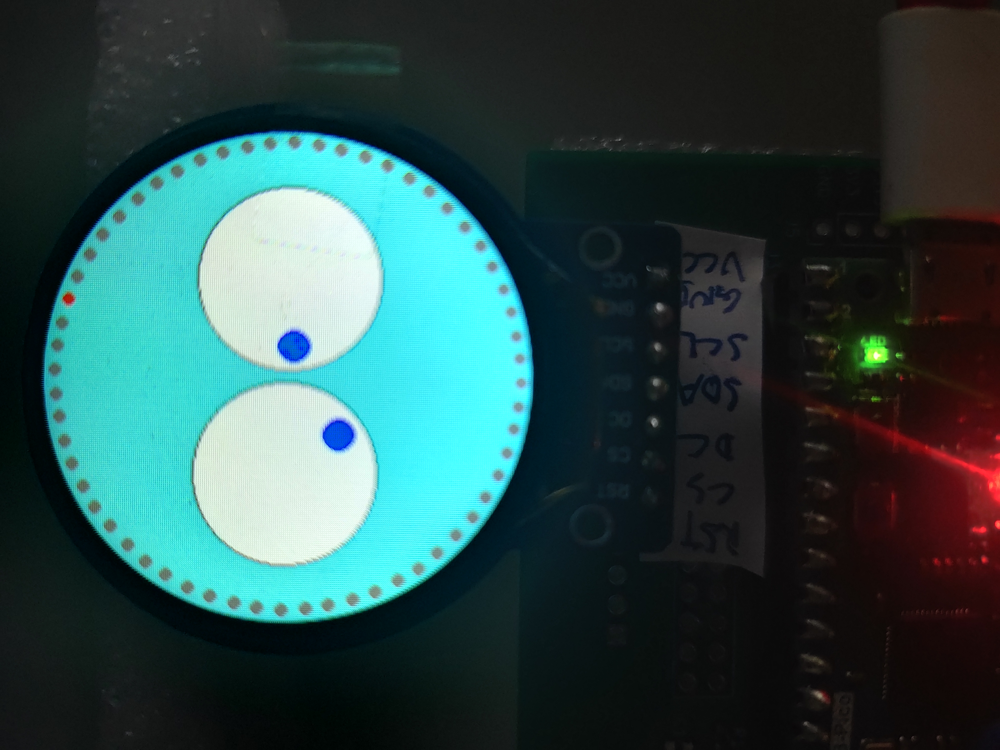
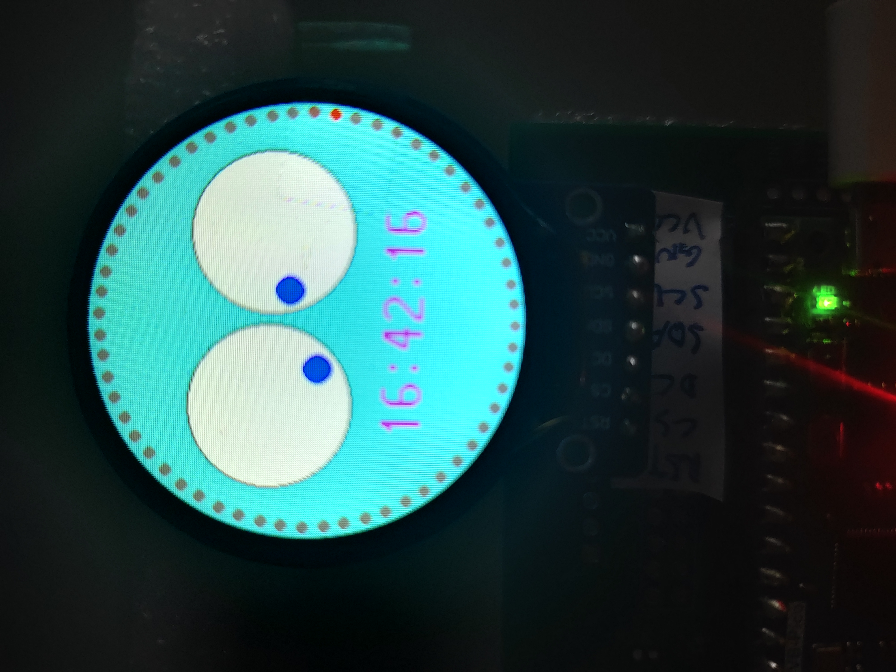

## Introduction
This projet leverages eyes UI to act as a clock. Hours and minutes are shown by left eye and right eye respectively. Second is shown by one of the sixty circles.


<p float="left">
  
  
</p>


## Demo board
[](https://github.com/teamprof/github-pico-1hz-challenge/blob/main/doc/image/hand-made-board.jpg)


[](https://github.com/teamprof/freertos-coral-swimmer/blob/main/LICENSE)

<a href="https://www.buymeacoffee.com/teamprof" target="_blank"></a>


---
## Hardware
The following components are required for this project:
1. [WizFi360-EVB-Pico](https://www.digikey.hk/zh/products/detail/wiznet/WIZFI360-EVB-PICO/16515823)
2. [1.28" TFT LCD Display Module Round RGB 240 * 240 GC9A01](https://www.amazon.com/dp/B0B7TFRNN1?psc=1&ref=ppx_yo2ov_dt_b_product_details)


---
### pins connection between WizFi360-EVB-Pico and LCD Display Module GC9A01
```
+-----------------------+-----------------------+
|   WizFi360-EVB-Pico   | GC9A01 Display Module |
+-----------+-----------+-----------+-----------+
|   GPIO #  |   pin #   |   label   |   pin #   |
+-----------+-----------+-----------+-----------+
|    3V3    |    36     |    VCC    |     1     |
|    GND    |    18     |    GND    |     2     |
|   GPIO10  |    14     |    SCL    |     3     |
|   GPIO11  |    15     |    SDA    |     4     |
|   GPIO15  |    20     |    DC     |     5     |
|   GPIO13  |    17     |    CS     |     6     |
|   GPIO14  |    19     |    RST    |     7     |
+-----------------------+-----------------------+
```


---
## Software architecture
There are three critical tasks in the system: App, GUI, and Wiznet.
App functions as the system controller, managing and communicating with the other tasks.
GUI responds to the RTC update event (AppEvent.RtcUpdate) by displaying time information on the GC9A01 display.
Wiznet connects to the NTP server to retrieve the correct time and initializes the RP2040 RTC.
```
  +------------------+
  | main             |
  |   +--------------+ 
  |   | App          |
  |   |   timer_task |
  |   +--------------+           
  |   | Gui          |      
  |   |   gc9a01     |      
  |   +--------------+       
  |   | Wiznet       | 
  |   |   wizfi360   | 
  |   +--------------+
  +------------------+       

```
---

## event communication between Wiznet task and App task
```
 internet                   wiznet                    app
     |                        |                        |
     |      SNTP request      |                        |
     | <--------------------- |                        |
     |                        |                        |
     |      SNTP response     |                        |
     | ---------------------> |                        |
     |                        |                        |
     |                        |  AppEvent.SntpUpdate   |
     |                        | ---------------------> |
     |                        |                        |      update RP2040 RTC
     |                        |                        | -------------------------->
     |                        |                        |

```

## event communication between timer task,  App task and Gui task
```
 timer_task                  app                      gui
     |                        |                        |
     |   AppEvent.Timer1Hz    |                        |
     | ---------------------> |                        |
     |                        |                        |
     |                        |  AppEvent.RtcUpdate    |
     |                        | ---------------------> |
     |                        |                        |    update GC9A01 display
     |                        |                        | -------------------------->
     |                        |                        |

```

---

## Demo settings
WizFi360 connected to WiFi AP is required to synchronize RP2040 system clock by retrieving the current time from an Internet-based Network Time Protocol (NTP) server.
WiFi credentials are stored in the file "secrets.py". Please replace them with your own WiFi settings.
```
wifi = {
    "ssid": "<replace with WiFi SSID>",
    "password": "<replace with WiFi password>",
}
```

To help the user understand the time information presented on the artistic clock UI, this demo includes two user interfaces: one is a standard UI (without a digital clock), and the other features a digital clock. 
User can enable the digital clock by setting "ENABLE_DIGITAL_CLOCK = True" in "class DigitalClock" in digital_clock.py.
```
class DigitalClock:
    ENABLE_DIGITAL_CLOCK = True
```

To allow the user to visualize the artistic clock UI without waiting 24 hours, a fast RTC simulation is implemented. This simulation generates an RtcUpdate event every 100 milliseconds instead of once per second.
User can enable the digital clock by setting "ENABLE_DIGITAL_CLOCK = True" in "class App" in app.py
```
class App(PyProf):
    ENABLE_FAST_SIMULATION = True
```

### Please refer to source code for details

### source code will be available on github by 19 Aug 2025

---
## Demo video 
1. [pico-1hz-challenge: demo](https://youtube.com/shorts/82v6k3LMab8)  
2. [Hours minutes demo](https://youtube.com/shorts/9_L3yjMmC4k)  
3. [Seconds demo](https://youtube.com/shorts/ZjNen-49hpA)  

---


### License
- The project is licensed under GNU GENERAL PUBLIC LICENSE Version 3
---

### Copyright
- Copyright 2025 teamprof.net@gmail.com. All rights reserved.


